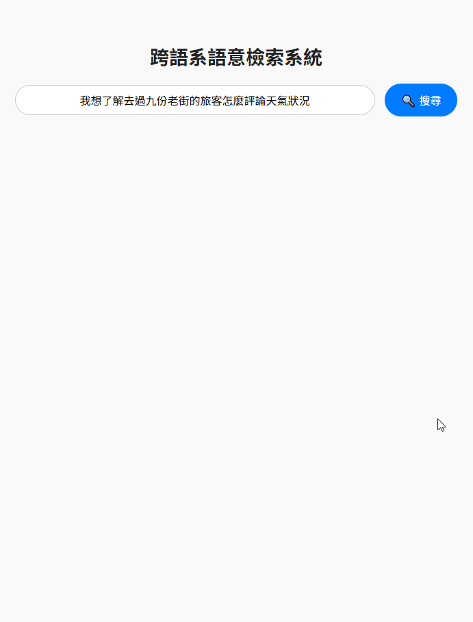
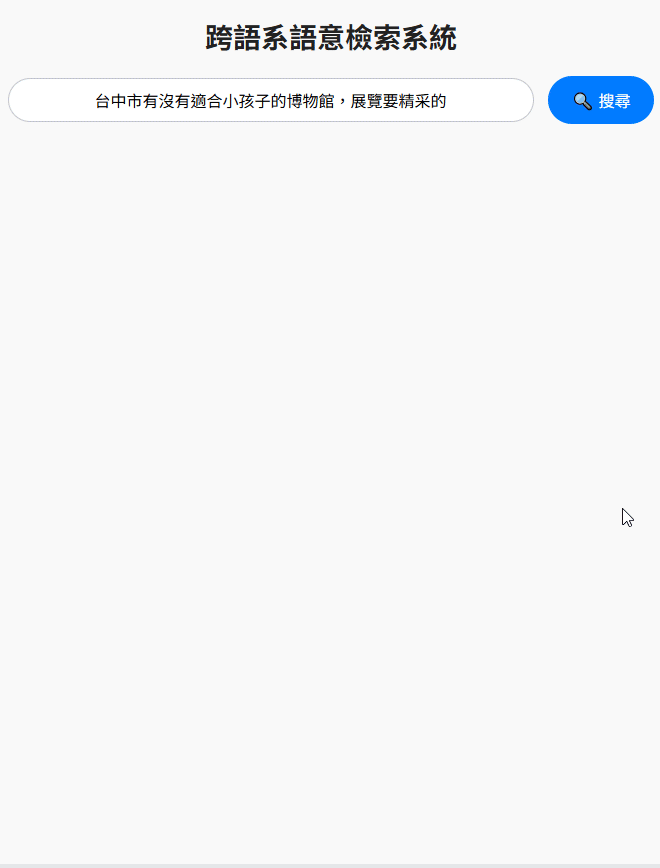
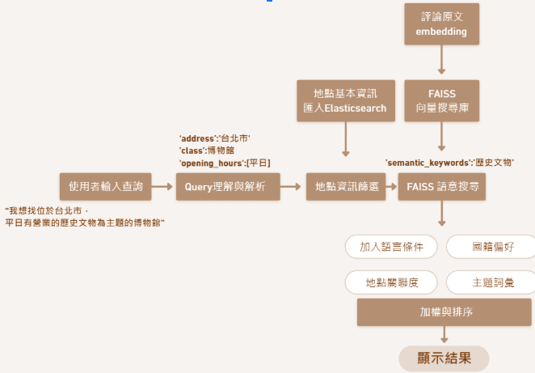

# TouristLens: 跨語系旅遊景點語意檢索與推薦系統

[簡要介紹] TouristLens 是一個基於大量旅遊評論數據的資料科學專案。它結合了自然語言處理 (NLP) 技術、高效能向量搜尋與推薦系統，旨在深入理解不同語系旅客的旅遊偏好與痛點，並建構一個能提供個人化、跨語系景點推薦的端到端原型系統。  
[Brief Intro] TouristLens is a data science project built upon a large volume of tourist review data. It integrates Natural Language Processing (NLP) techniques, efficient vector search, and recommendation systems to deeply understand travel preferences and pain points of tourists across different language backgrounds. The project aims to construct an end-to-end prototype system that provides personalized, cross-lingual point-of-interest (POI) recommendations.

## 🎯 專案目標 (Project Goals)

*   深入探討不同語系外籍旅客的旅遊行為模式與獨特偏好。
*   分析海量景點評論數據，精準掌握旅客的需求與抱怨痛點。
*   **建構一套高效能、支援多語種的旅遊景點語意檢索與推薦系統原型。**
*   提供具體的數據驅動洞察與改善建議，協助旅遊業者優化服務與產品。

## ✨ 核心功能與特色 (Core Features)

*   **多語種文本數據處理與深度分析：** 能夠處理來自不同語言的評論文本。
*   **基於最新深度學習模型的語意理解：** 運用 BERT、XLM-RoBERTa 等模型進行文本向量化，捕捉語言的深層含義，克服文化差異與語義歧義。
*   **高效能向量相似度檢索：** 整合 FAISS 向量資料庫，實現對百萬級向量數據的快速、精準相似度搜尋。
*   **結合多維度資訊的個人化景點推薦：** 結合旅客查詢語意與景點分類、地點等資訊，提供高度相關的景點推薦。
*   **數據驅動的旅客洞察提取：** 透過 NLP 技術從評論中挖掘旅客偏好、熱門話題及潛在問題。

**[系統的操作演示，點擊可以看原圖]**

<!-- 在這裡加入一個空白行 -->

<table>
<tr>
<td align="center">
 <!-- 使用 HTML  標籤 -->
 
</td>
<td align="center">
 <!-- 使用 HTML  標籤 -->
 
</td>
<td align="center">
 <!-- 使用 HTML  標籤 -->
 
</td>
<td align="center">
 <!-- 使用 HTML  標籤 -->
 
</td>
</tr>
</table>

<!-- 在這裡加入一個空白行 -->

*上述展示系統處理不同類型查詢並返回語義相關景點結果的操作流程與能力。*

## 🏗️ 技術棧與架構 (Technical Stack & Architecture)

本專案是使用 Python 建構的端到端資料科學解決方案原型，主要技術棧與流程如下：

*   **資料獲取 (Data Acquisition):**
    *   透過**網路爬蟲**從 Google Maps獲取數據。
    *   使用 **Request** 取得評論內容。
    *   成功獲取約 **651 萬筆**旅遊評論及 **838 個**景點基本資料。
*   **數據處理 (Data Processing):**
    *   使用 **Pandas, NumPy** 進行數據清洗、轉換與初步分析。
    *   運用 **ckip-transformers** 進行中文文本的分詞處理。
*   **資料儲存與檢索 (Data Storage & Retrieval):**
    *   使用 **MySQL** 儲存結構化景點基本資料。
    *   使用 **Elasticsearch** 儲存原始評論及部分處理後數據，並用於快速檢索。
*   **自然語言處理 (NLP):**
    *   應用 **Hugging Face Transformers** 函式庫載入並應用多種深度學習模型。
    *   使用 **BERT, XLM-RoBERTa, MPNet** 等模型進行文本向量化 (Embedding)，捕捉語意。
    *   使用 **BGE-M3** 進行評論主題挖掘。
    *   使用 **twitter-xlm-roberta-base-sentiment** 進行負面情感分析。
*   **向量搜尋 (Vector Search):**
    *   使用 **FAISS** 構建向量索引，實現對景點向量的高效、精準相似度搜尋。
*   **機器學習/數據挖掘 (ML/Data Mining):**
    *   運用 **Apriori 演算法** 進行關聯性分析，挖掘潛在的景點組合模式。
*   **資料可視化與分析呈現 (Visualization & Analysis Presentation):**
    *   使用 **Tableau** 進行數據分析結果的可視化呈現。
*   **Web 框架 (Demo Interface):**
    *   使用 **Flask** 建構簡單的互動式演示介面。

專案系統架構圖：

數據規模：約 **651 萬筆**跨語種評論數據及 **838 個**台灣景點資訊。

## 📊 數據分析洞察 (Data Analysis Insights)

完整的數據分析過程、方法與所有發現，請參考完整專案簡報(連結在下方)

## 📁 程式碼結構 (Code Structure)

本專案的核心程式碼主要位於 `/MAIN` 資料夾下，其結構與主要功能如下：

*   `/MAIN/`: 專案主要程式碼目錄
    *   `app.py`:
        *   **Web 應用主程式 (Flask):** 負責初始化 Flask 應用。
        *   處理使用者透過網頁或 API 發送的查詢請求。
        *   **協調器 (Orchestrator):** 呼叫 `query_understanding.py` 解析查詢，呼叫 `es_query.py` 進行初步的 Elasticsearch 檢索。
        *   管理非同步的 FAISS 語意檢索 (`retrieval_feiss.py`)，並提供 API 接口用於獲取非同步檢索結果。
        *   載入地點資訊用於補全結果。
    *   `query_understanding.py`:
        *   **查詢理解模組:** 整合 **Google Gemini 1.5 Pro 模型**，負責將使用者輸入的自然語言查詢解析為結構化的參數字典（例如提取地點、類別、語意關鍵詞等）。
        *   包含與 Gemini API 互動的邏輯和解析、清理 API 回應的功能。
    *   `es_query.py`:
        *   **Elasticsearch 查詢模組:** 負責根據 `query_understanding.py` 解析出的結構化查詢參數，建構並執行針對 Elasticsearch 的查詢。
        *   包含完全匹配和模糊匹配的查詢邏輯，用於從 Elasticsearch 中檢索相關景點的 `location_id`。
    *   `retrieval_faiss.py`:
        *   **FAISS 語意檢索模組:**
            *   載入預訓練的**語意 Embedding 模型** (**SentenceTransformer: paraphrase-multilingual-mpnet-base-v2**)。
            *   載入預先建好的 **FAISS 索引** (`faiss_index_ivf_new.bin`) 和對應的 `review_ids_new.npy`。
            *   讀取評論和地點資訊。
            *   根據 `es_query.py` 返回的地點列表和解析出的語意關鍵詞，執行基於 FAISS 的**向量相似度搜尋**，在相關地點的評論中查找最相似的評論。
            *   處理 FAISS 搜尋結果，合併地點資訊，並返回包含相關評論的景點列表。

## 📄 專案簡報 (Project Presentation)

如需了解更完整的專案背景、深入的數據分析方法、技術實現細節、成果展示及未來展望，請參閱完整的專案簡報：
[Link to presentation](https://reurl.cc/W0A8M7)

## 👋 聯絡我 (Contact Me)

對於本專案有任何問題、建議或潛在的合作機會，非常歡迎隨時與我聯繫：

*   GitHub Profile: [github.com/bebluke](https://github.com/bebluke)
*   LinkedIn: [linkedin.com/in/lukemjwu](https://www.linkedin.com/in/lukemjwu/)
*   Email: beb.luke@gmail.com

---
